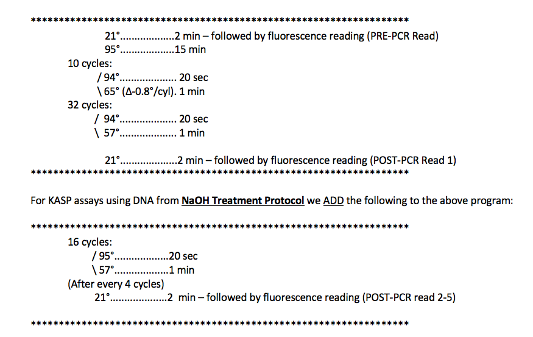

## Notes before starting PCR:
* Because scoring is based on relative clustering, a minimum number of samples is recommended:
  -	No less than 8 for a well-developed, trusted assay
  -	No less than 16-24 for new, untested assays
  -	No less than 20-24 when trying to identify heterozygotes.  In this case one should include homozygous controls.
-	Always include a No Template Control (NTC)
-	Ensure your RT-PCR machine/Fluorometer is set to take fluorescent readings at the wavelengths recommended for VIC and FAM (see KASP Manual)

The following is the standard PCR program we use for KASP assays using **high-quality DNA** (CTAB, Qiagen kits).   We have added a few cycles to the program recommended by LGCBiosciences in the KASP Manual.

## Notes on Program(s):
* The first step is a PRE-PCR Fluorescence Reading at room temperature.
  - LGC Biosciences does not include a PRE-PCR reading in their recommendations, but we find that using a PRE-PCR read to standardize the data really helps to resolve the clustering. (see calculation and plot below) 
  - The second step is a hot start for the Taq.  This is required to activate the Taq included in the KASP reagent.
  - The first cycling step is 10 cycles consisting of a 2-step touchdown ranging from 65°C to 57°C (decreasing 0.8°C/cycle).
* This is recommended by LGC Biosciences.  The touchdown helps to make the PCR program universal for all KASP assays despite minor differences in optimal annealing temperatures.
  - The second cycling step consists of 32 cycles with an annealing/extension of 57°C.
  - A POST-PCR Fluorescence Reading is then taken at room temperature.
* It is highly recommended that all fluorescence readings are taken at the same temperature, preferably at room temperature.
  - We find, with high quality DNA (CTAB, Qiagen Kits), this is typically enough cycling to detect and score differences in fluorescence readings.  
  - For DNA taken from NaOH Treatment, or for assays where fluorescence readings are still too low after 42 cycles, we add more cycles. 
  - The Add-on consists of 16 cycles, with a fluorescence reading after every 4 cycles.
  - The Add-on provides POST-PCR fluorescence readings at 4 more time-points.   This allows one the flexibility to find the optimal time-point from which to take and plot the data. 

## Plotting the Data:
-	If the software you are using to view your plots is not user-friendly, or inadequate, use Excel.
-	Transfer the PRE-PCR and POST-PCR fluorescence readings to Excel.
-	Use the following calculation for both VIC and FAM fluorescence readings of all samples as well as the NTC:
* ((POST –PRE)/PRE) x 100
* The result will equal % Change in Fluorescence
-	Generate a Scatter Plot using “% Change in VIC Fluorescence” vs “% Change in FAM Fluorescence”
-	If the add-on program was used, you can plot all 5 time-points independently and compare to identify which results are easiest to score accurately.
-	Once plotted you can determine which lines score for each respective allele.

